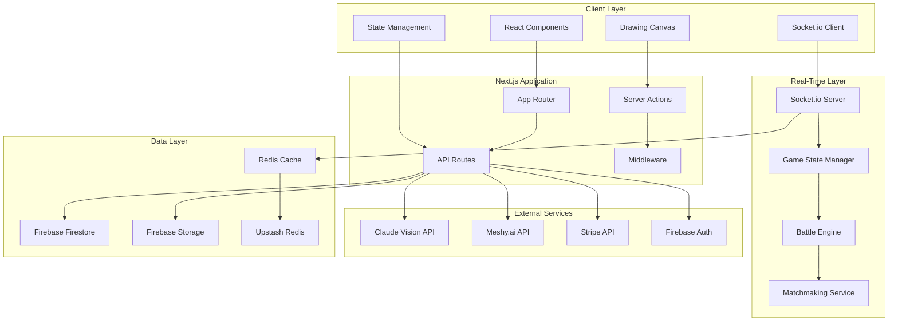
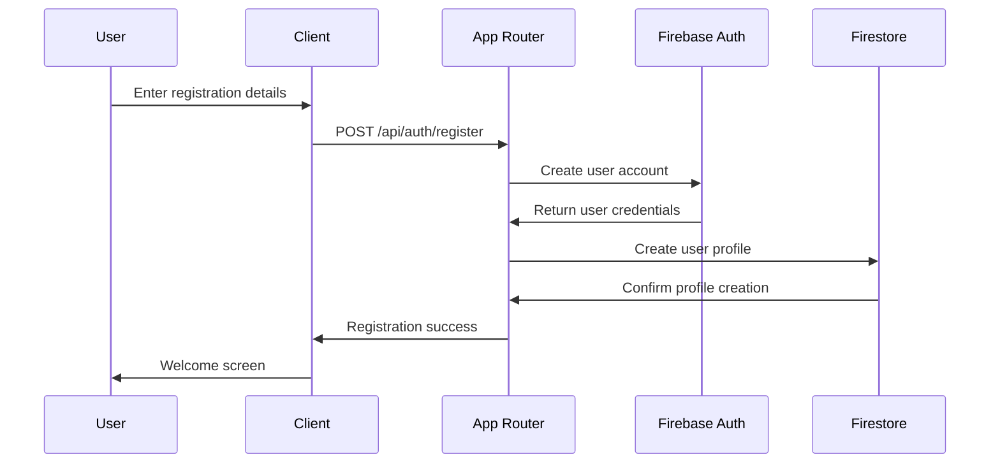
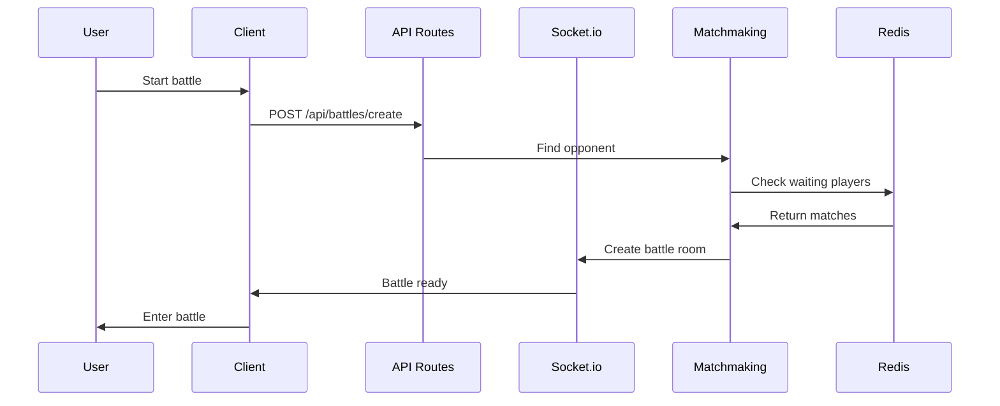
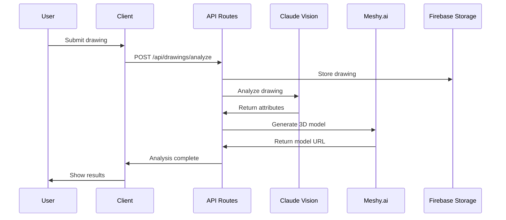
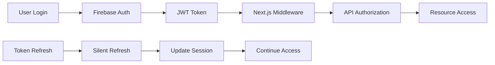

# 🏗️ System Architecture Overview

## 🎯 Architecture Philosophy

Drawn of War 2 follows a **hybrid architecture** combining:
- **Server-side rendering** for optimal performance and SEO
- **Client-side interactivity** for smooth user experience
- **Real-time communication** for multiplayer battles
- **Microservices approach** for scalability and maintainability

## 🔧 High-Level Architecture



## 🏛️ Architecture Layers

### 1. Presentation Layer (Client)
**Technology**: Next.js 15 App Router, React 18, TypeScript
- **Purpose**: User interface and interaction
- **Responsibilities**:
  - Render components and pages
  - Handle user interactions
  - Manage client-side state
  - Real-time UI updates
  - Drawing canvas management

### 2. Application Layer (Next.js)
**Technology**: Next.js Server Actions, API Routes, Middleware
- **Purpose**: Business logic and API endpoints
- **Responsibilities**:
  - Authentication and authorization
  - Data validation and sanitization
  - External API integration
  - Payment processing
  - User management

### 3. Real-Time Layer (Socket.io)
**Technology**: Socket.io, Node.js, Redis
- **Purpose**: Real-time multiplayer communication
- **Responsibilities**:
  - Battle state synchronization
  - Player matchmaking
  - Real-time event broadcasting
  - Connection management
  - Lag compensation

### 4. Data Layer (Firebase + Redis)
**Technology**: Firebase Firestore, Firebase Storage, Redis
- **Purpose**: Data persistence and caching
- **Responsibilities**:
  - User profiles and preferences
  - Battle history and statistics
  - Drawing and model storage
  - Caching for performance
  - Session management

### 5. Integration Layer (External APIs)
**Technology**: Claude Vision, Meshy.ai, Stripe
- **Purpose**: External service integration
- **Responsibilities**:
  - AI drawing analysis
  - 3D model generation
  - Payment processing
  - Authentication services

## 🔄 Data Flow Architecture

### User Registration Flow


### Battle Creation Flow


### Drawing Analysis Flow


## 🚀 Performance Architecture

### Caching Strategy
```typescript
// Multi-level caching approach
interface CacheStrategy {
  level1: {
    type: 'Browser Cache'
    duration: '5 minutes'
    data: ['static assets', 'API responses']
  }
  level2: {
    type: 'Next.js Cache'
    duration: '1 hour'
    data: ['page components', 'API routes']
  }
  level3: {
    type: 'Redis Cache'
    duration: '24 hours'
    data: ['user sessions', 'battle state']
  }
  level4: {
    type: 'CDN Cache'
    duration: '7 days'
    data: ['images', 'static files']
  }
}
```

### Load Balancing Strategy
```typescript
// Horizontal scaling approach
interface ScalingStrategy {
  frontend: {
    type: 'Edge deployment'
    platform: 'Vercel'
    regions: ['us-east-1', 'eu-west-1', 'ap-southeast-1']
  }
  backend: {
    type: 'Serverless functions'
    platform: 'Vercel Functions'
    autoScaling: true
  }
  realtime: {
    type: 'Socket.io cluster'
    adapter: 'Redis'
    instances: 'auto-scale'
  }
  database: {
    type: 'Firebase multi-region'
    caching: 'Redis cluster'
    backups: 'automated'
  }
}
```

## 🔐 Security Architecture

### Authentication Flow


### Authorization Matrix
```typescript
interface AuthorizationMatrix {
  guest: {
    pages: ['/login', '/register', '/']
    api: ['GET /api/health']
    sockets: []
  }
  user: {
    pages: ['/dashboard', '/battles', '/profile']
    api: ['GET /api/user/*', 'POST /api/battles/*']
    sockets: ['join-battle', 'submit-drawing']
  }
  premium: {
    pages: [...'user.pages', '/premium']
    api: [...'user.api', 'POST /api/premium/*']
    sockets: [...'user.sockets', 'premium-features']
  }
  admin: {
    pages: [...'premium.pages', '/admin']
    api: [...'premium.api', 'ALL /api/admin/*']
    sockets: [...'premium.sockets', 'admin-controls']
  }
}
```

## 📊 Monitoring Architecture

### Observability Stack
```typescript
interface ObservabilityStack {
  metrics: {
    tool: 'Vercel Analytics'
    dashboards: ['Performance', 'User Behavior', 'Business']
    alerts: ['Error Rate', 'Response Time', 'User Drop-off']
  }
  logging: {
    tool: 'Console + Structured Logging'
    levels: ['ERROR', 'WARN', 'INFO', 'DEBUG']
    context: ['user_id', 'session_id', 'battle_id']
  }
  tracing: {
    tool: 'OpenTelemetry'
    spans: ['API Routes', 'External Calls', 'Database']
    sampling: '10% production, 100% development'
  }
  uptime: {
    tool: 'Uptime Robot'
    endpoints: ['/api/health', '/api/battles', '/socket.io']
    frequency: '1 minute'
  }
}
```

### Performance Monitoring
```typescript
interface PerformanceMetrics {
  frontend: {
    FCP: 'First Contentful Paint < 1.5s'
    LCP: 'Largest Contentful Paint < 2.5s'
    CLS: 'Cumulative Layout Shift < 0.1'
    FID: 'First Input Delay < 100ms'
    TTI: 'Time to Interactive < 3.5s'
  }
  backend: {
    responseTime: 'Average < 200ms, P95 < 500ms'
    errorRate: '< 0.1% for critical paths'
    throughput: '1000+ requests/minute'
    availability: '99.9% uptime'
  }
  realtime: {
    connectionTime: '< 500ms'
    messageLatency: '< 100ms'
    concurrentUsers: '100+ per server'
    messageRate: '60 messages/second'
  }
}
```

## 🔧 Development Architecture

### Code Organization
```
src/
├── app/                    # Next.js App Router
│   ├── (auth)/            # Authentication routes
│   ├── (dashboard)/       # Dashboard routes
│   ├── (battles)/         # Battle routes
│   └── api/               # API routes
├── components/            # React components
│   ├── ui/               # Base UI components
│   ├── forms/            # Form components
│   ├── game/             # Game-specific components
│   └── layout/           # Layout components
├── lib/                  # Utility libraries
│   ├── ai/               # AI integration
│   ├── auth/             # Authentication
│   ├── database/         # Database utilities
│   ├── payments/         # Payment processing
│   └── realtime/         # Socket.io utilities
├── hooks/                # Custom React hooks
├── stores/               # State management
├── types/                # TypeScript types
├── utils/                # Utility functions
└── styles/               # CSS and styling
```

### Testing Architecture
```typescript
interface TestingStrategy {
  unit: {
    tool: 'Jest + React Testing Library'
    coverage: '80% minimum'
    focus: ['utils', 'hooks', 'components']
  }
  integration: {
    tool: 'Playwright'
    coverage: 'Critical user paths'
    focus: ['auth flow', 'battle flow', 'payment flow']
  }
  e2e: {
    tool: 'Playwright'
    coverage: 'Complete user journeys'
    focus: ['registration to battle', 'payment to tokens']
  }
  performance: {
    tool: 'Lighthouse CI'
    thresholds: 'Performance > 90'
    focus: ['loading times', 'bundle sizes']
  }
}
```

## 📈 Scalability Architecture

### Horizontal Scaling Strategy
```typescript
interface ScalabilityPlan {
  phase1: {
    users: '0-1K'
    architecture: 'Single deployment'
    database: 'Firebase single region'
    cdn: 'Vercel global'
  }
  phase2: {
    users: '1K-10K'
    architecture: 'Multi-region deployment'
    database: 'Firebase multi-region'
    cdn: 'Vercel + custom CDN'
  }
  phase3: {
    users: '10K-100K'
    architecture: 'Microservices'
    database: 'Firebase + Redis cluster'
    cdn: 'Global CDN with edge computing'
  }
  phase4: {
    users: '100K+'
    architecture: 'Kubernetes cluster'
    database: 'Sharded database'
    cdn: 'Multi-CDN strategy'
  }
}
```

## 🎯 Success Metrics

### Technical KPIs
- **Response Time**: < 200ms average
- **Error Rate**: < 0.1% for critical paths  
- **Uptime**: 99.9% availability
- **Concurrent Users**: 100+ per server
- **Build Time**: < 3 minutes
- **Deploy Time**: < 2 minutes

### Business KPIs
- **User Acquisition**: 1K+ users in 3 months
- **Conversion Rate**: 5% free to paid
- **Revenue**: $10K+ MRR by month 6
- **Retention**: 40% day 7, 20% day 30
- **Engagement**: 15+ minutes average session

---

*This architecture is designed to scale from MVP to enterprise-grade application while maintaining developer productivity and user experience.*
