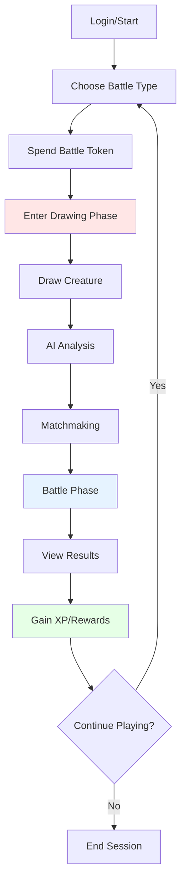
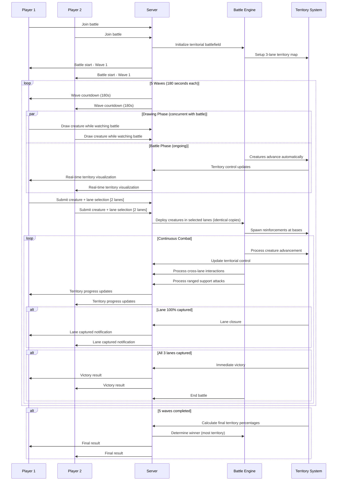

# ⚔️ Game Mechanics & Battle System

## 🎯 Core Game Design Philosophy

Drawn of War 2 combines **creativity** with **strategy**, where player artistic expression directly impacts gameplay outcomes. The game emphasizes:

- **Accessibility**: Easy to learn, hard to master
- **Creativity**: Unique creatures through drawing
- **Strategy**: Tactical decision-making
- **Fairness**: Skill-based outcomes over pay-to-win
- **Engagement**: Quick battles with deep progression

## 🎮 Core Game Loop



## 🎨 Drawing System

### Drawing Canvas Specifications
```typescript
interface DrawingCanvas {
  dimensions: {
    width: 400
    height: 400
    aspectRatio: '1:1'
  }
  
  tools: {
    brush: {
      sizes: [1, 2, 4, 8, 12, 16, 20]
      colors: ['#000000', '#FF0000', '#00FF00', '#0000FF', '#FFFF00', '#FF00FF', '#00FFFF', '#FFFFFF']
      opacity: 0.1 to 1.0
    }
    
    eraser: {
      sizes: [4, 8, 16, 32]
      mode: 'destination-out'
    }
    
    utilities: {
      undo: 'up to 20 steps'
      redo: 'up to 20 steps'
      clear: 'reset canvas'
      zoom: '50% to 200%'
    }
  }
  
  constraints: {
    maxFileSize: '1MB'
    format: 'PNG'
    minDrawingArea: '5% of canvas'
    maxDrawingArea: '95% of canvas'
  }
}
```

### Drawing Quality Assessment
```typescript
interface DrawingQuality {
  complexity: {
    low: 'Simple shapes, minimal detail'
    medium: 'Multiple elements, some detail'
    high: 'Complex shapes, rich detail'
  }
  
  recognizability: {
    abstract: 'Unclear creature form'
    stylized: 'Recognizable but artistic'
    realistic: 'Clear creature representation'
  }
  
  completeness: {
    partial: 'Incomplete or sketch-like'
    complete: 'Finished creature design'
    detailed: 'Rich detail and shading'
  }
}
```

## 🤖 AI Analysis System

### Claude Vision Integration
```typescript
interface AIAnalysisPrompt {
  system: `You are analyzing a hand-drawn creature for a battle game. 
  Analyze the drawing and provide creature statistics based on visual elements.
  
  Consider:
  - Size and bulk for health/defense
  - Sharp elements for attack
  - Limbs and body shape for speed
  - Overall design for special abilities
  
  Return structured JSON with confidence scores.`
  
  userPrompt: `Analyze this creature drawing and determine:
  1. Attack power (1-100)
  2. Defense rating (1-100)
  3. Speed rating (1-100)
  4. Health points (1-100)
  5. Elemental type (fire, water, earth, air, neutral)
  6. Special abilities (up to 3)
  7. Creature type classification
  8. Confidence score (0-1)
  9. Reasoning for each attribute`
}
```

### Attribute Calculation System
```typescript
interface AttributeCalculation {
  attack: {
    baseRange: [10, 90]
    modifiers: {
      sharpElements: +10 // claws, teeth, spikes
      size: +5 // larger creatures
      weaponLike: +15 // holding weapons
      complexity: +5 // detailed design
    }
    fallbackValue: 50
  }
  
  defense: {
    baseRange: [10, 90]
    modifiers: {
      armor: +15 // shell, scales, armor
      size: +10 // bulk and size
      thickness: +5 // thick lines
      shields: +10 // defensive elements
    }
    fallbackValue: 50
  }
  
  speed: {
    baseRange: [10, 90]
    modifiers: {
      legs: +10 // multiple legs
      wings: +20 // flying capability
      streamlined: +15 // aerodynamic shape
      size: -5 // larger = slower
    }
    fallbackValue: 50
  }
  
  health: {
    baseRange: [50, 150]
    modifiers: {
      size: +20 // larger creatures
      robustness: +10 // thick, sturdy design
      complexity: +5 // detailed creatures
      magical: +15 // mystical elements
    }
    fallbackValue: 100
  }
}
```

### Special Abilities System
```typescript
interface SpecialAbilities {
  fire: {
    trigger: 'Fire-like elements in drawing'
    effect: 'Burn damage over time'
    description: 'Deals 5 damage per turn for 3 turns'
  }
  
  ice: {
    trigger: 'Ice/crystal elements or blue colors'
    effect: 'Freeze opponent for 1 turn'
    description: 'Opponent loses next turn'
  }
  
  lightning: {
    trigger: 'Jagged lines or electric elements'
    effect: 'Chain lightning damage'
    description: 'Deals damage to all opponents'
  }
  
  healing: {
    trigger: 'Heart, cross, or healing symbols'
    effect: 'Regenerate health'
    description: 'Restore 20 HP per turn'
  }
  
  shield: {
    trigger: 'Shield or defensive elements'
    effect: 'Damage reduction'
    description: 'Reduce incoming damage by 25%'
  }
  
  flight: {
    trigger: 'Wings or flying elements'
    effect: 'Dodge chance'
    description: '30% chance to avoid attacks'
  }
}
```

## ⚔️ Territorial Wave Combat System

### Territorial Wave Battle Flow


### Territorial Wave Combat Mechanics
```typescript
interface TerritorialWaveCombatSystem {
  waveStructure: {
    totalWaves: 5
    waveInterval: 180 // seconds (3 minutes)
    deployment: '1 creature per wave, deployed in 2 selected lanes simultaneously'
    reinforcement: 'New waves spawn at player base, can stack with existing creatures'
    earlyDeployment: 'Available if all player creatures are defeated before wave timer'
  }
  
  territorialControl: {
    advancement: 'Creatures automatically move toward enemy base'
    territoryCapture: 'Ground captured as creatures advance'
    persistence: 'Captured territory remains even if creatures die'
    visualization: 'Real-time color bleeding showing control percentages'
  }
  
  laneSystem: {
    laneCount: 3 // Top, Middle, Bottom
    crossLaneMovement: 'Creatures can flank between adjacent lanes'
    rangedSupport: 'Ranged creatures can attack across lanes'
    laneCapture: '100% control closes lane to opponent'
  }
  
  combatInteractions: {
    meleeEngagement: 'Direct combat when creatures meet'
    rangedAttacks: 'Support attacks across adjacent lanes'
    flanking: 'Movement between lanes for tactical advantage'
    advancement: 'Automatic forward movement when path is clear'
  }
  
  victoryConditions: {
    immediate: 'Capture all 3 lanes (100% control each)'
    timeLimit: 'Most total territory after 5 waves'
    laneBonus: 'Captured lanes provide strategic advantage'
  }
  
  damageCalculation: {
    baseDamage: 'attacker.attack - defender.defense'
    minimumDamage: 1
    criticalHit: {
      chance: 0.05 // 5%
      multiplier: 1.5
    }
    typeModifiers: {
      fire_vs_ice: 1.5
      water_vs_fire: 1.5
      earth_vs_lightning: 1.5
      air_vs_earth: 1.5
    }
    rangedSupport: {
      crossLaneDamage: 0.75 // 25% damage reduction for cross-lane attacks
      range: 'Adjacent lanes only'
    }
  }
  
  specialAbilities: {
    activation: 'Automatic when conditions met'
    timing: 'During advancement, combat, or support actions'
    stacking: 'Same abilities do not stack'
    territorialEffects: 'Some abilities affect territory capture rate'
  }
  
  strategicElements: {
    multiTasking: 'Draw next creature while watching current battle'
    waveCoordination: 'Plan reinforcements based on battlefield state'
    adaptation: 'React to territorial control in real-time'
    laneStrategy: 'Choose optimal lane combinations for deployment'
  }
}
```

### Territorial Combat Balancing
```typescript
interface TerritorialBalanceSystem {
  attributeScaling: {
    attack: 'Linear scaling 1:1 damage'
    defense: 'Diminishing returns after 80'
    speed: 'Affects advancement rate and flanking ability'
    health: 'Linear scaling 1:1 HP'
    advancement: 'Territory capture rate based on creature speed'
  }
  
  territorialMechanics: {
    captureRate: 'Base 1% territory per second of advancement'
    speedModifier: 'Speed affects capture rate (+/-20% max)'
    contestedTerritory: '50% capture rate when enemies present'
    persistentControl: 'Captured territory remains when creatures die'
  }
  
  waveBalance: {
    deploymentCost: '1 creature per wave across 2 lanes'
    reinforcementStacking: 'Multiple waves can cooperate in same lanes'
    timingStrategy: '180-second cycles balance drawing vs. watching'
    earlyDeployment: 'Risk/reward for aggressive early deployment'
  }
  
  crossLaneInteractions: {
    flankingEffectiveness: 'Speed-based success rate for lane changes'
    rangedSupportDamage: '75% damage for cross-lane attacks'
    adjacencyRule: 'Only adjacent lanes can interact'
    tacticalAdvantage: 'Flanking provides +25% damage bonus'
  }
  
  powerLevels: {
    weak: 'Total stats 200-280 + slow advancement'
    average: 'Total stats 280-360 + moderate advancement'
    strong: 'Total stats 360-440 + fast advancement'
    legendary: 'Total stats 440-520 + rapid advancement'
  }
  
  matchmaking: {
    powerDifference: 'Max 50 point difference'
    advancementBalance: 'Consider creature speed in matching'
    timeout: 'Widen range after 30 seconds'
    fallback: 'AI opponent if no match found'
  }
  
  victoryBalance: {
    immediateVictory: '100% control of all 3 lanes (rare but decisive)'
    territorialVictory: 'Aggregate territory control after 5 waves'
    comebackMechanics: 'Late waves can still shift territorial balance'
    laneStrategy: 'Multiple viable strategies (all lanes vs. focused lanes)'
  }
}
```

## 🎭 Creature Types & Elements

### Creature Classifications
```typescript
interface CreatureTypes {
  beast: {
    description: 'Animal-like creatures'
    bonuses: '+10 attack, +5 speed'
    weaknesses: '-5 defense'
    examples: ['wolves', 'bears', 'lions']
  }
  
  dragon: {
    description: 'Mythical dragon creatures'
    bonuses: '+15 attack, +10 health'
    weaknesses: '-10 speed'
    examples: ['fire dragons', 'ice dragons']
  }
  
  humanoid: {
    description: 'Human-like creatures'
    bonuses: '+5 all stats'
    weaknesses: 'No specific weaknesses'
    examples: ['warriors', 'mages', 'knights']
  }
  
  mechanical: {
    description: 'Robot or machine creatures'
    bonuses: '+15 defense, +10 health'
    weaknesses: '-15 speed'
    examples: ['robots', 'mechs', 'golems']
  }
  
  elemental: {
    description: 'Pure elemental beings'
    bonuses: '+20 special ability power'
    weaknesses: 'Vulnerable to opposing element'
    examples: ['fire spirits', 'water elementals']
  }
  
  cosmic: {
    description: 'Space or celestial beings'
    bonuses: '+10 all stats'
    weaknesses: 'Rare classification'
    examples: ['aliens', 'star beings', 'cosmic entities']
  }
}
```

### Elemental System
```typescript
interface ElementalTypes {
  fire: {
    strengths: ['ice', 'nature']
    weaknesses: ['water', 'earth']
    abilities: ['burn', 'ignite', 'flame_burst']
    color: '#FF4444'
  }
  
  water: {
    strengths: ['fire', 'earth']
    weaknesses: ['lightning', 'ice']
    abilities: ['freeze', 'tsunami', 'healing_rain']
    color: '#4444FF'
  }
  
  earth: {
    strengths: ['lightning', 'air']
    weaknesses: ['water', 'nature']
    abilities: ['earthquake', 'stone_armor', 'root_bind']
    color: '#8B4513'
  }
  
  air: {
    strengths: ['earth', 'fire']
    weaknesses: ['lightning', 'ice']
    abilities: ['tornado', 'wind_slash', 'flight']
    color: '#87CEEB'
  }
  
  lightning: {
    strengths: ['water', 'air']
    weaknesses: ['earth', 'fire']
    abilities: ['chain_lightning', 'paralysis', 'storm']
    color: '#FFD700'
  }
  
  ice: {
    strengths: ['air', 'water']
    weaknesses: ['fire', 'lightning']
    abilities: ['freeze', 'ice_armor', 'blizzard']
    color: '#00FFFF'
  }
  
  nature: {
    strengths: ['earth', 'water']
    weaknesses: ['fire', 'ice']
    abilities: ['regeneration', 'poison', 'growth']
    color: '#228B22'
  }
  
  neutral: {
    strengths: []
    weaknesses: []
    abilities: ['balance', 'adaptation', 'counter']
    color: '#808080'
  }
}
```

## 🏆 Progression System

### Experience & Leveling
```typescript
interface ProgressionSystem {
  experience: {
    sources: {
      battleWin: 100
      battleLoss: 25
      firstWin: 50
      winStreak: 25
      dailyBonus: 75
    }
    
    levelRequirements: {
      level1: 0
      level2: 100
      level3: 250
      level4: 450
      level5: 700
      // Formula: level * 150 + (level - 1) * 50
    }
  }
  
  rewards: {
    level2: 'Battle token + new color'
    level3: 'Special brush + achievement'
    level4: '2 battle tokens + new canvas'
    level5: 'Premium features preview'
    level10: 'Custom creature gallery'
    level20: 'Tournament access'
  }
}
```

### Achievement System
```typescript
interface AchievementSystem {
  combat: {
    firstWin: 'Win your first battle'
    winStreak5: 'Win 5 battles in a row'
    winStreak10: 'Win 10 battles in a row'
    perfectBattle: 'Win without taking damage'
    comeback: 'Win from less than 20% health'
  }
  
  creative: {
    firstDrawing: 'Create your first creature'
    artisticGenius: 'Create 50 unique creatures'
    masterpiece: 'Create a creature rated 95+ by AI'
    colorMaster: 'Use all available colors'
    detailOriented: 'Create highly detailed creatures'
  }
  
  social: {
    socialButterfly: 'Battle 10 different opponents'
    helpfulPlayer: 'Help 5 new players'
    shareCreation: 'Share your creature creation'
    communityLove: 'Receive 100 likes on creations'
  }
  
  progression: {
    dedicated: 'Play for 7 consecutive days'
    veteran: 'Play for 30 consecutive days'
    collector: 'Unlock all creature types'
    master: 'Reach level 25'
  }
}
```

## 🎯 Core Territorial Wave Battle Mode

### Standard Territorial Battle Format
```typescript
interface TerritorialBattleMode {
  format: {
    description: 'Standard 1v1 territorial wave battles'
    requirements: '1 battle token per battle'
    rewards: 'XP, battle tokens (on win), achievements'
    waveStructure: '5 waves, 180 seconds each'
    totalDuration: '15 minutes maximum'
    matchmaking: 'Skill-based matchmaking'
    battlefieldSize: 'Wide territorial battlefield'
  }
  
  battleSystem: {
    waves: 5
    waveInterval: 180 // seconds (3 minutes)
    laneCount: 3 // Top, Middle, Bottom
    deployment: '1 creature per wave, deploys in 2 selected lanes simultaneously'
    reinforcement: 'New waves spawn at base every 180 seconds'
    stackingAllowed: true // Multiple waves can be in same lanes
  }
  
  territorialMechanics: {
    advancement: 'Automatic movement toward enemy base'
    territoryCapture: 'Real-time color bleeding as creatures advance'
    persistence: 'Captured territory remains even after creature death'
    visualization: 'Color gradient showing control percentage'
  }
  
  victoryConditions: {
    immediate: 'Capture all 3 lanes (100% control each)'
    timeLimit: 'Most total territory after 5 waves'
    laneCapture: '100% lane control closes lane to opponent'
    earlyDeployment: 'Available if all creatures die before wave timer'
  }
}
```

### Special Events
```typescript
interface SpecialEvents {
  weeklyTheme: {
    description: 'Themed creature challenges'
    duration: '7 days'
    rewards: 'Exclusive cosmetics'
    examples: ['Dragon Week', 'Robot Month', 'Fantasy Creatures']
  }
  
  doubleDays: {
    description: 'Double XP or token rewards'
    frequency: 'Every weekend'
    multiplier: 2
    announcement: '24 hours in advance'
  }
  
  seasonalEvents: {
    description: 'Holiday-themed events'
    examples: ['Halloween Horror', 'Winter Wonderland', 'Spring Awakening']
    rewards: 'Limited-time items'
    duration: '2-4 weeks'
  }
}
```

## 📊 Game Balance & Tuning

### Balance Monitoring
```typescript
interface BalanceMetrics {
  winRates: {
    byCreatureType: 'Track win rates per type'
    byElement: 'Track elemental advantages'
    byPowerLevel: 'Ensure fair matchmaking'
    target: '45-55% win rate for all categories'
  }
  
  gameLength: {
    averageBattleTime: '10-15 minutes'
    waveCount: '5 waves standard'
    timeouts: 'Less than 5% of battles'
  }
  
  playerEngagement: {
    sessionLength: '15+ minutes average'
    battlesPerSession: '3-5 battles'
    returnRate: '60% next day'
  }
}
```

### Tuning Mechanisms
```typescript
interface TuningSystem {
  hotfixes: {
    attributeAdjustments: 'Server-side stat modifications'
    abilityTweaks: 'Cooldown and power adjustments'
    elementalBalance: 'Damage multiplier changes'
    deployment: 'No client update required'
  }
  
  seasonalAdjustments: {
    metaShifts: 'Introduce new strategies'
    freshness: 'Prevent stale gameplay'
    frequency: 'Monthly balance patches'
  }
  
  playerFeedback: {
    collection: 'In-game feedback system'
    analysis: 'Data-driven balance decisions'
    communication: 'Transparent change logs'
  }
}
```

## 🎨 Visual & Audio Design

### Battle Animations
```typescript
interface BattleVisuals {
  creatures: {
    idle: 'Subtle breathing/floating animation'
    attack: 'Lunge or strike animation'
    hit: 'Damage reaction animation'
    death: 'Dissolve or collapse animation'
    special: 'Ability-specific effects'
  }
  
  effects: {
    damage: 'Floating damage numbers'
    healing: 'Green sparkle effects'
    critical: 'Screen flash + larger numbers'
    elemental: 'Element-specific particles'
  }
  
  arena: {
    background: 'Dynamic 3D environment'
    lighting: 'Dramatic battle lighting'
    camera: 'Cinematic camera angles'
    transitions: 'Smooth scene changes'
  }
}
```

### Sound Design
```typescript
interface AudioSystem {
  music: {
    menu: 'Calm, inspiring background music'
    battle: 'Intense, rhythmic battle music'
    victory: 'Triumphant victory fanfare'
    defeat: 'Somber but encouraging theme'
  }
  
  effects: {
    drawing: 'Subtle brush stroke sounds'
    ui: 'Satisfying click and swipe sounds'
    battle: 'Impact sounds for attacks'
    special: 'Unique sounds per ability'
  }
  
  settings: {
    masterVolume: 'Global volume control'
    musicVolume: 'Background music only'
    sfxVolume: 'Sound effects only'
    mute: 'Complete audio disable'
  }
}
```

## 🎯 Success Metrics

### Core KPIs
```typescript
interface GameMetrics {
  engagement: {
    averageSessionLength: '15+ minutes'
    battlesPerSession: '3-5 battles'
    dailyActiveUsers: '70% of registered'
    retention: '60% day 1, 40% day 7, 20% day 30'
  }
  
  monetization: {
    conversionRate: '5% free to paid'
    averageRevenue: '$10 per paying user'
    tokenPurchaseRate: '2 purchases per week'
    churnRate: 'Less than 10% monthly'
  }
  
  balance: {
    averageBattleTime: '30-90 seconds'
    winRateDistribution: '45-55% for all archetypes'
    playerComplaintRate: 'Less than 5%'
    balanceUpdateFrequency: 'Monthly'
  }
}
```

---

*This game mechanics system creates a fair, engaging, and strategically deep experience while maintaining the creative core of the drawing-based gameplay.*
