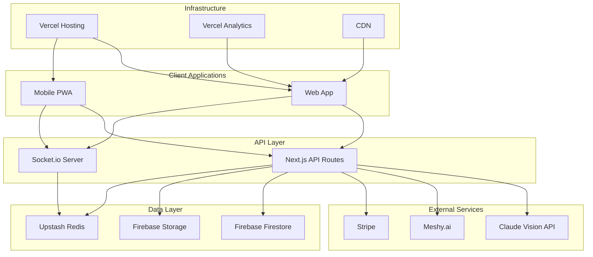
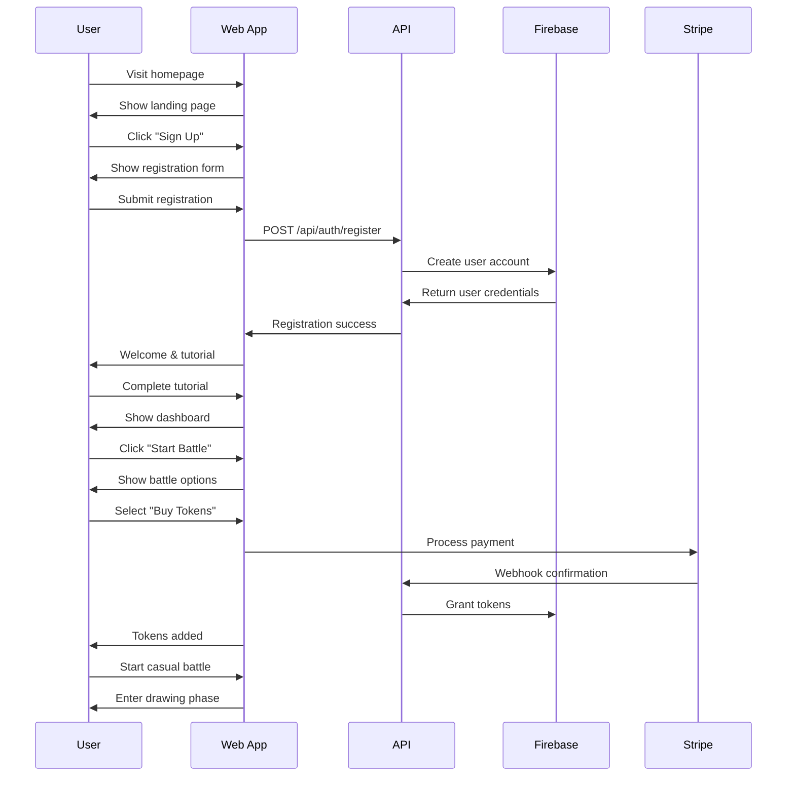
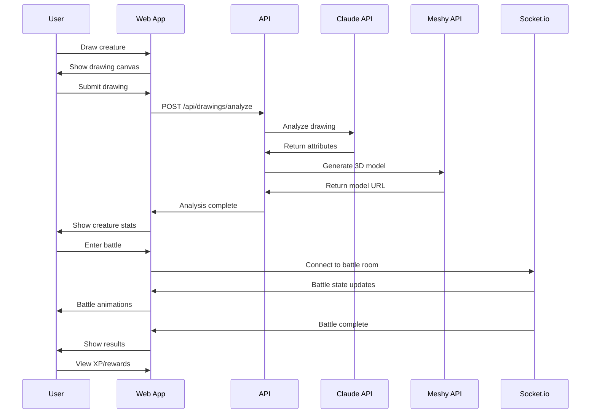

# 🎮 Drawn of War 2 - Complete Project Overview

## 🚀 Project Vision

Drawn of War 2 is the **next-generation multiplayer battle game** where creativity meets strategy. Players draw their own creatures which are then brought to life through advanced AI analysis and 3D model generation, creating unique battle units for real-time competitive gameplay.

### Core Innovation
- **AI-Powered Creativity**: Transform drawings into battle-ready creatures with unique stats
- **Real-Time Strategy**: Fast-paced battles with tactical depth
- **Social Competition**: Leaderboards, tournaments, and community sharing
- **Accessible Monetization**: Fair play-to-enjoy model with optional enhancements

## 🎯 Success Metrics & Goals

### Business Objectives
```typescript
interface BusinessGoals {
  userAcquisition: {
    month1: '1,000 registered users'
    month3: '10,000 registered users'
    month6: '50,000 registered users'
    year1: '100,000 registered users'
  }
  
  retention: {
    day1: '60% retention rate'
    day7: '40% retention rate'
    day30: '20% retention rate'
    day90: '10% retention rate'
  }
  
  monetization: {
    conversionRate: '5% free to paid'
    averageRevenue: '$15 per paying user'
    monthlyRevenue: '$50K by month 6'
    yearlyRevenue: '$500K by year 1'
  }
  
  engagement: {
    sessionLength: '15+ minutes average'
    battlesPerSession: '3-5 battles'
    dailyActiveUsers: '70% of monthly users'
    creatureCreationRate: '2+ per user per session'
  }
}
```

### Technical Excellence
```typescript
interface TechnicalTargets {
  performance: {
    pageLoadTime: '< 2 seconds'
    apiResponseTime: '< 500ms'
    battleLatency: '< 100ms'
    aiProcessingTime: '< 30 seconds'
  }
  
  reliability: {
    uptime: '99.9% availability'
    errorRate: '< 0.1%'
    dataIntegrity: '100% payment accuracy'
    securityIncidents: '0 major breaches'
  }
  
  scalability: {
    concurrentUsers: '10,000+ simultaneous'
    dailyBattles: '100,000+ battles'
    storageCapacity: '10TB+ drawings/models'
    globalLatency: '< 200ms worldwide'
  }
}
```

## 🏗️ Architecture Summary

### Technology Stack
```typescript
interface TechStack {
  frontend: {
    framework: 'Next.js 15'
    language: 'TypeScript'
    styling: 'Tailwind CSS'
    components: 'shadcn/ui'
    state: 'Zustand'
    animations: 'Framer Motion'
  }
  
  backend: {
    platform: 'Next.js API Routes'
    database: 'Firebase Firestore'
    storage: 'Firebase Storage'
    cache: 'Upstash Redis'
    realtime: 'Socket.io'
    auth: 'Firebase Auth'
  }
  
  external: {
    ai: 'Claude Vision API'
    models: 'Meshy.ai'
    payments: 'Stripe'
    hosting: 'Vercel'
    monitoring: 'Vercel Analytics'
  }
}
```

### System Architecture


## 🎮 Core Features

### 1. User Management System
```typescript
interface UserManagement {
  authentication: {
    methods: ['Email/Password', 'Google OAuth', 'Apple Sign-In']
    security: 'Firebase Auth with JWT tokens'
    features: ['Email verification', 'Password reset', '2FA support']
  }
  
  profiles: {
    data: 'Display name, avatar, stats, achievements'
    preferences: 'Theme, sound, notifications, language'
    privacy: 'Public/private profile settings'
  }
  
  progression: {
    levels: 'XP-based leveling system'
    rewards: 'Tokens, cosmetics, features'
    achievements: 'Combat, creative, social achievements'
  }
}
```

### 2. Drawing & AI System
```typescript
interface DrawingSystem {
  canvas: {
    tools: 'Brush, eraser, colors, undo/redo'
    formats: 'PNG export, multiple resolutions'
    constraints: 'Size limits, content filtering'
  }
  
  aiAnalysis: {
    primary: 'Claude Vision API for attribute analysis'
    attributes: 'Attack, defense, speed, health'
    classification: 'Creature type, elemental affinity'
    fallback: 'Template-based analysis for reliability'
  }
  
  modelGeneration: {
    primary: 'Meshy.ai for 3D model creation'
    formats: 'GLB, OBJ, FBX support'
    optimization: 'Mobile-friendly polygon counts'
    fallback: 'Predefined model templates'
  }
}
```

### 3. Battle System
```typescript
interface BattleSystem {
  modes: {
    casual: 'Standard 1v1 battles'
    ranked: 'Competitive ladder system'
    practice: 'AI opponents for training'
    tournament: 'Bracketed competitions'
  }
  
  mechanics: {
    turnBased: 'Strategic turn-based combat'
    realTime: 'Live battle animations'
    balance: 'Rock-paper-scissors elemental system'
    special: 'Unique abilities based on drawings'
  }
  
  networking: {
    realTime: 'Socket.io for live updates'
    latency: 'Lag compensation algorithms'
    reconnection: 'Automatic reconnection handling'
    spectating: 'Live battle viewing'
  }
}
```

### 4. Monetization System
```typescript
interface MonetizationSystem {
  battleTokens: {
    pricing: '$5 for 1, $20 for 5, $35 for 10'
    consumption: '1 token per casual battle'
    rewards: 'Daily bonuses, achievement rewards'
    freemium: 'Limited free battles daily'
  }
  
  premium: {
    features: 'Advanced drawing tools, priority matching'
    subscription: 'Monthly/yearly premium access'
    cosmetics: 'Exclusive avatars, battle arenas'
    storage: 'Extended creature gallery'
  }
  
  payments: {
    processor: 'Stripe for secure payments'
    methods: 'Credit cards, Apple Pay, Google Pay'
    currencies: 'USD, EUR, GBP support'
    refunds: 'Automated refund system'
  }
}
```

## 📊 Data Models

### User Data Structure
```typescript
interface UserDocument {
  // Identity
  uid: string
  email: string
  displayName: string
  avatar?: string
  
  // Game Progress
  level: number
  xp: number
  battleTokens: number
  
  // Statistics
  stats: {
    totalBattles: number
    wins: number
    losses: number
    draws: number
    winRate: number
    currentStreak: number
    bestStreak: number
    totalDamageDealt: number
    totalDamageReceived: number
    favoriteCreatureType: string
    averageBattleTime: number
  }
  
  // Preferences
  preferences: {
    theme: 'light' | 'dark' | 'auto'
    soundEnabled: boolean
    musicEnabled: boolean
    notificationsEnabled: boolean
    language: string
    autoSaveDrawings: boolean
  }
  
  // Achievements
  achievements: Achievement[]
  
  // Metadata
  createdAt: Timestamp
  lastActive: Timestamp
  isActive: boolean
  isPremium: boolean
  version: number
}
```

### Battle Data Structure
```typescript
interface BattleDocument {
  // Identity
  id: string
  type: 'casual' | 'ranked' | 'practice' | 'tournament'
  
  // Status
  status: 'waiting' | 'active' | 'completed' | 'abandoned'
  isPrivate: boolean
  roomCode?: string
  
  // Participants
  players: {
    player1: PlayerInBattle
    player2: PlayerInBattle | null
  }
  
  // Game State
  gameState: {
    phase: 'waiting' | 'drawing' | 'analyzing' | 'battling' | 'completed'
    turn: number
    currentPlayer: 'player1' | 'player2'
    timeLimit: number
    turnStartTime: Timestamp | null
  }
  
  // Battle Data
  drawings: {
    player1: DrawingReference | null
    player2: DrawingReference | null
  }
  
  // Results
  results: {
    winner: 'player1' | 'player2' | 'draw'
    battleLog: BattleAction[]
    duration: number
    xpAwarded: { player1: number, player2: number }
    tokensAwarded: { player1: number, player2: number }
  } | null
  
  // Metadata
  createdAt: Timestamp
  updatedAt: Timestamp
  completedAt?: Timestamp
  tokensConsumed: number
  version: number
}
```

### Drawing Data Structure
```typescript
interface DrawingDocument {
  // Identity
  id: string
  userId: string
  battleId?: string
  
  // Image Data
  imageData: {
    original: string // base64 encoded PNG
    compressed?: string // optimized version
    thumbnail?: string // small preview
    width: number
    height: number
    format: 'png' | 'jpeg' | 'webp'
    fileSize: number
  }
  
  // AI Analysis
  aiAnalysis: {
    status: 'processing' | 'completed' | 'failed'
    processingStarted: Timestamp
    processingCompleted?: Timestamp
    confidence: number
    attributes: {
      attack: number
      defense: number
      speed: number
      health: number
    }
    type: string
    elementalType: string
    specialAbilities: string[]
    unitCount: number
    description: string
    reasoning: string
    usedFallback: boolean
  }
  
  // 3D Model Generation
  meshGeneration: {
    status: 'pending' | 'processing' | 'completed' | 'failed'
    processingStarted?: Timestamp
    processingCompleted?: Timestamp
    modelUrl?: string
    thumbnailUrl?: string
    qualityScore?: number
    isOptimized: boolean
    usedFallback: boolean
  }
  
  // Metadata
  createdAt: Timestamp
  isPublic: boolean
  tags: string[]
  likeCount: number
  viewCount: number
  version: number
}
```

## 🔄 User Flow Diagrams

### Registration to First Battle


### Drawing to Battle Completion


## 🎯 Development Roadmap

### Phase 1: MVP Core (Months 1-2)
```typescript
interface MVPFeatures {
  authentication: 'Firebase Auth integration'
  userProfiles: 'Basic profile management'
  drawingCanvas: 'Simple drawing interface'
  aiAnalysis: 'Claude Vision integration'
  battleSystem: 'Basic turn-based combat'
  payments: 'Stripe token purchases'
  realtime: 'Socket.io battles'
  deployment: 'Vercel production deployment'
}
```

### Phase 2: Enhanced Features (Months 3-4)
```typescript
interface EnhancedFeatures {
  advancedDrawing: 'Better drawing tools'
  modelGeneration: 'Meshy.ai 3D models'
  matchmaking: 'Skill-based matching'
  achievements: 'Achievement system'
  leaderboards: 'Global rankings'
  tournaments: 'Competitive events'
  socialFeatures: 'Friend system'
  mobileOptimization: 'PWA support'
}
```

### Phase 3: Polish & Scale (Months 5-6)
```typescript
interface PolishFeatures {
  performance: 'Optimization & caching'
  security: 'Security hardening'
  analytics: 'Advanced tracking'
  moderation: 'Content moderation'
  support: 'Customer support tools'
  marketing: 'Referral system'
  localization: 'Multi-language support'
  accessibility: 'WCAG compliance'
}
```

### Phase 4: Growth & Expansion (Months 7-12)
```typescript
interface GrowthFeatures {
  mobileApp: 'Native mobile apps'
  advancedAI: 'Improved AI models'
  creatorTools: 'Advanced creation tools'
  marketplace: 'Creature marketplace'
  guilds: 'Team competitions'
  streaming: 'Twitch integration'
  esports: 'Professional tournaments'
  partnerships: 'Brand collaborations'
}
```

## 💰 Business Model

### Revenue Streams
```typescript
interface RevenueModel {
  battleTokens: {
    description: 'Primary revenue from token sales'
    pricing: 'Tiered pricing with bulk discounts'
    projection: '70% of total revenue'
  }
  
  premiumSubscription: {
    description: 'Monthly/yearly premium features'
    pricing: '$9.99/month or $99.99/year'
    projection: '20% of total revenue'
  }
  
  cosmetics: {
    description: 'Avatars, battle arenas, effects'
    pricing: '$2.99 - $19.99 per item'
    projection: '8% of total revenue'
  }
  
  tournaments: {
    description: 'Entry fees for special events'
    pricing: '$4.99 - $24.99 per tournament'
    projection: '2% of total revenue'
  }
}
```

### Cost Structure
```typescript
interface CostStructure {
  development: {
    salaries: '$50K/month for 4 developers'
    tools: '$2K/month for development tools'
    percentage: '60% of expenses'
  }
  
  infrastructure: {
    hosting: '$1K/month Vercel Pro'
    database: '$500/month Firebase'
    ai: '$2K/month Claude + Meshy'
    percentage: '15% of expenses'
  }
  
  marketing: {
    ads: '$5K/month performance marketing'
    content: '$2K/month content creation'
    percentage: '20% of expenses'
  }
  
  operations: {
    support: '$1K/month customer support'
    legal: '$500/month legal compliance'
    percentage: '5% of expenses'
  }
}
```

## 🎯 Success Factors

### Critical Success Factors
1. **AI Quality**: Reliable and engaging creature analysis
2. **Real-time Performance**: Low-latency battle experience
3. **User Onboarding**: Smooth introduction to gameplay
4. **Balance**: Fair and competitive game mechanics
5. **Community**: Active player base and engagement
6. **Monetization**: Sustainable revenue model
7. **Technical Reliability**: 99.9% uptime and performance
8. **Content Moderation**: Safe and appropriate content

### Risk Mitigation
```typescript
interface RiskMitigation {
  technical: {
    aiFailure: 'Fallback analysis system'
    serverOutage: 'Multi-region deployment'
    dataLoss: 'Automated backups'
    security: 'Regular security audits'
  }
  
  business: {
    competition: 'Unique AI-powered gameplay'
    userRetention: 'Engaging progression system'
    monetization: 'Multiple revenue streams'
    scalability: 'Serverless architecture'
  }
  
  legal: {
    privacy: 'GDPR/CCPA compliance'
    content: 'AI-powered moderation'
    payments: 'PCI DSS compliance'
    terms: 'Clear terms of service'
  }
}
```

## 🏆 Competitive Advantages

### Unique Value Propositions
1. **AI-Powered Creativity**: First game to use advanced AI for drawing analysis
2. **Real-time 3D Generation**: Instant 3D models from 2D drawings
3. **Accessible Gameplay**: Easy to learn, hard to master mechanics
4. **Fair Monetization**: Pay-to-enjoy, not pay-to-win model
5. **Cross-Platform**: Works on web, mobile, and desktop
6. **Social Features**: Community-driven content and competitions
7. **Continuous Innovation**: Regular updates and new features

### Market Positioning
- **Target Audience**: Creative gamers aged 16-35
- **Market Size**: $200B+ global gaming market
- **Competitive Landscape**: Differentiated from traditional battle games
- **Growth Strategy**: Viral sharing through unique creature creations

---

*This comprehensive project overview provides the complete roadmap for building Drawn of War 2 into a successful, scalable, and engaging multiplayer gaming experience that combines creativity, strategy, and cutting-edge technology.*
