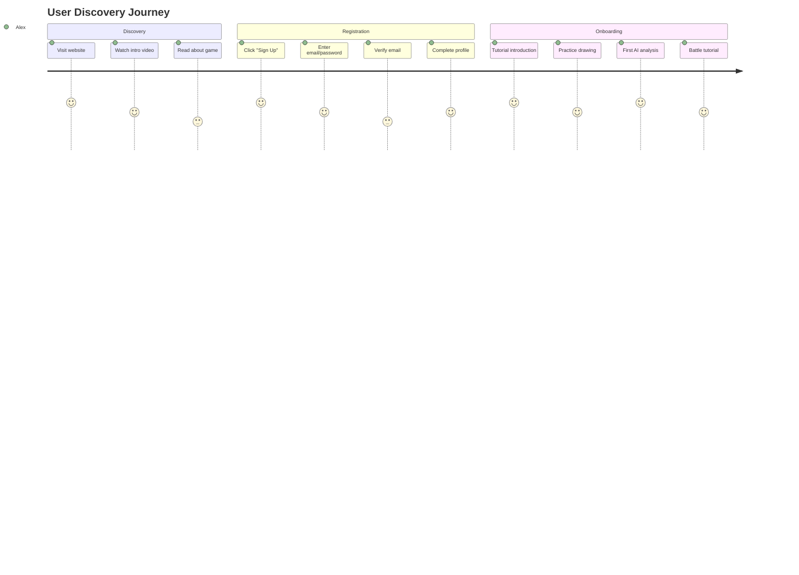
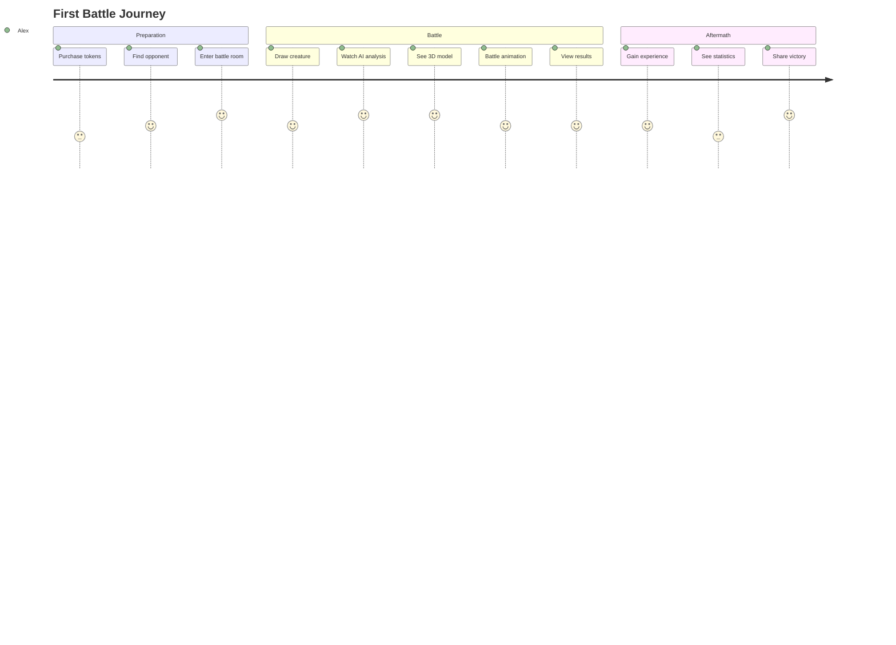
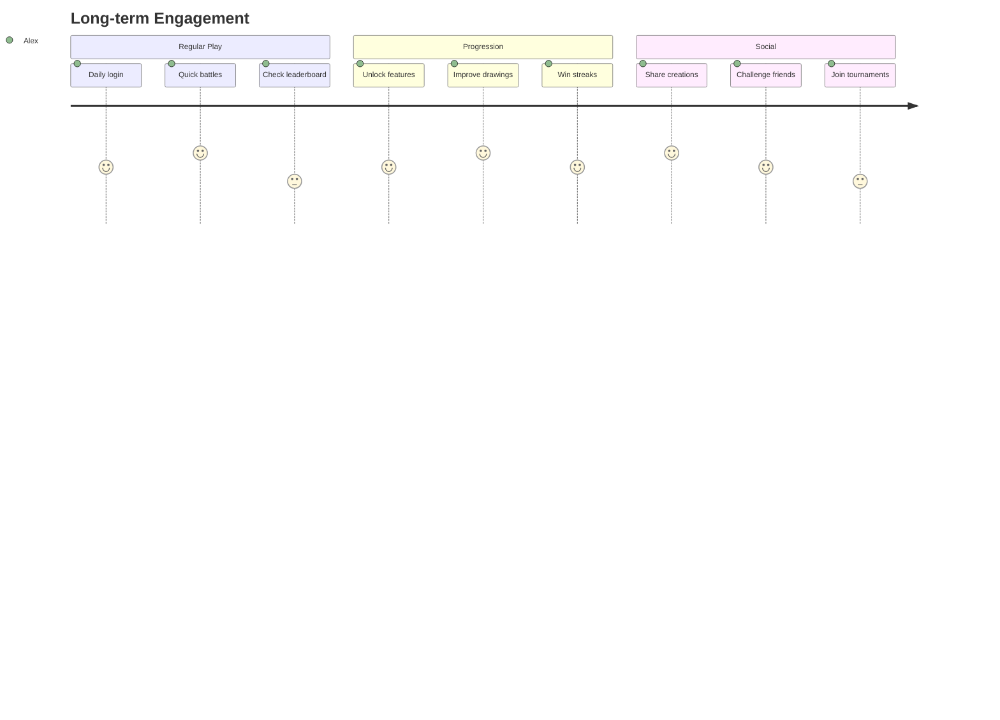

# 📖 Complete User Journey & Stories

## 🎯 User Personas

### Primary Persona: "The Casual Gamer" (Alex)
- **Age**: 25-35
- **Background**: Professional who games in spare time
- **Devices**: Mobile phone, laptop
- **Gaming Experience**: Casual mobile games, some PC games
- **Motivation**: Quick fun sessions, social competition
- **Pain Points**: Complex controls, long commitment times

### Secondary Persona: "The Creative Player" (Sam)
- **Age**: 18-28
- **Background**: Art student or creative professional
- **Devices**: Tablet with stylus, desktop computer
- **Gaming Experience**: Varied, enjoys creative games
- **Motivation**: Express creativity, share creations
- **Pain Points**: Limited creative tools, lack of recognition

### Tertiary Persona: "The Competitive Gamer" (Jordan)
- **Age**: 16-25
- **Background**: Student or young professional
- **Devices**: Gaming PC, high-end mobile
- **Gaming Experience**: Competitive online games
- **Motivation**: Win battles, climb rankings
- **Pain Points**: Unfair advantages, slow matchmaking

## 🎮 Complete User Journey

### Phase 1: Discovery & Registration (First 5 minutes)


### Phase 2: First Battle Experience (10-15 minutes)


### Phase 3: Engagement & Retention (Ongoing)


## 📋 Epic User Stories

### Epic 1: User Authentication & Onboarding
**As a** new user  
**I want to** easily create an account and understand the game  
**So that** I can start playing quickly and confidently  

#### Story 1.1: Quick Registration
```gherkin
Feature: User Registration
  As a new user
  I want to create an account quickly
  So that I can start playing immediately

  Scenario: Successful registration
    Given I am on the homepage
    When I click "Sign Up"
    And I enter my email "alex@example.com"
    And I enter a strong password
    And I confirm my password
    And I click "Create Account"
    Then I should see a verification email sent message
    And I should receive a verification email
    When I click the verification link
    Then I should be logged in
    And I should see the welcome tutorial

  Scenario: Registration with existing email
    Given I am on the registration page
    When I enter an email that already exists
    And I submit the form
    Then I should see "Email already registered"
    And I should see a "Sign In" link

  Acceptance Criteria:
  - ✅ Email validation before submission
  - ✅ Password strength indicator
  - ✅ Clear error messages
  - ✅ Email verification within 5 minutes
  - ✅ Mobile-responsive design
```

#### Story 1.2: Interactive Tutorial
```gherkin
Feature: Game Tutorial
  As a new user
  I want to learn the game mechanics
  So that I can play effectively

  Scenario: Complete tutorial
    Given I am a new registered user
    When I see the tutorial introduction
    Then I should see an animated explanation
    And I should be able to skip if desired
    When I proceed to drawing practice
    Then I should see a guided drawing interface
    And I should see helpful tips
    When I complete my first drawing
    Then I should see the AI analysis process
    And I should understand the attributes
    When I proceed to battle tutorial
    Then I should see a mock battle
    And I should understand the battle mechanics

  Acceptance Criteria:
  - ✅ Tutorial can be skipped
  - ✅ Progress saved if interrupted
  - ✅ Interactive elements work on mobile
  - ✅ Clear visual feedback
  - ✅ Under 3 minutes completion time
```

### Epic 2: Drawing & AI Analysis
**As a** player  
**I want to** create unique creatures through drawing  
**So that** I can express creativity and have personalized battles  

#### Story 2.1: Drawing Interface
```gherkin
Feature: Drawing Canvas
  As a player
  I want to draw creatures easily
  So that I can create unique battle units

  Scenario: Create a drawing
    Given I am in a battle preparation phase
    When I access the drawing canvas
    Then I should see a clean drawing interface
    And I should see brush size options
    And I should see color palette
    And I should see undo/redo buttons
    When I draw a creature
    Then I should see real-time stroke feedback
    And I should be able to adjust my drawing
    When I finish drawing
    Then I should be able to preview my creation
    And I should be able to submit for analysis

  Scenario: Mobile drawing experience
    Given I am using a mobile device
    When I access the drawing canvas
    Then I should see touch-optimized controls
    And I should be able to zoom and pan
    And I should see finger-friendly UI elements
    When I draw with my finger
    Then I should see smooth stroke rendering
    And I should be able to use multi-touch gestures

  Acceptance Criteria:
  - ✅ Responsive canvas that scales properly
  - ✅ Smooth drawing on both desktop and mobile
  - ✅ Brush size from 1-20 pixels
  - ✅ Color palette with 16+ colors
  - ✅ Undo/redo with 20+ steps
  - ✅ Export to PNG format
  - ✅ File size under 1MB
```

#### Story 2.2: AI Analysis & Feedback
```gherkin
Feature: AI Drawing Analysis
  As a player
  I want my drawings analyzed by AI
  So that I get unique creature attributes

  Scenario: Successful AI analysis
    Given I have completed a drawing
    When I submit for AI analysis
    Then I should see a loading animation
    And I should see "Analyzing your creature..."
    When the analysis completes
    Then I should see creature attributes
    And I should see a confidence score
    And I should see the reasoning
    And I should see a 3D model preview
    When I view the detailed analysis
    Then I should see attack, defense, speed, health
    And I should see special abilities
    And I should see elemental type

  Scenario: AI analysis timeout
    Given I have submitted a drawing
    When the AI analysis takes longer than 30 seconds
    Then I should see a progress update
    And I should see estimated time remaining
    When the analysis takes longer than 60 seconds
    Then I should see fallback attributes
    And I should see "Using default analysis"
    And I should still be able to battle

  Acceptance Criteria:
  - ✅ Analysis completes within 30 seconds average
  - ✅ Fallback system for AI failures
  - ✅ Clear progress indicators
  - ✅ Confidence scores displayed
  - ✅ Detailed reasoning provided
  - ✅ Consistent attribute ranges
```

### Epic 3: Real-Time Battles
**As a** player  
**I want to** battle other players in real-time  
**So that** I can compete and test my creatures  

#### Story 3.1: Matchmaking System
```gherkin
Feature: Battle Matchmaking
  As a player
  I want to find opponents quickly
  So that I can start battles without waiting

  Scenario: Find a match
    Given I have battle tokens
    When I click "Find Battle"
    Then I should see matchmaking screen
    And I should see estimated wait time
    When a match is found
    Then I should see opponent information
    And I should see battle room invitation
    When I accept the invitation
    Then I should enter the battle room
    And I should see both players ready status

  Scenario: No matches available
    Given I am looking for a battle
    When no opponents are found within 60 seconds
    Then I should see "No matches found"
    And I should see options to:
      - Try again
      - Practice against AI
      - Create private room
    When I choose practice mode
    Then I should battle against AI
    And I should not consume tokens

  Acceptance Criteria:
  - ✅ Matchmaking within 30 seconds average
  - ✅ Skill-based matching when possible
  - ✅ Option to cancel matchmaking
  - ✅ Clear waiting indicators
  - ✅ Graceful handling of no matches
```

#### Story 3.2: Battle Experience
```gherkin
Feature: Real-Time Battle
  As a player
  I want to experience exciting battles
  So that I feel engaged and competitive

  Scenario: Complete battle flow
    Given I am matched with an opponent
    When the battle begins
    Then I should see both creatures on screen
    And I should see a 3D battle arena
    And I should see creature stats comparison
    When the battle calculations run
    Then I should see animated combat
    And I should see damage numbers
    And I should see special effects
    When the battle ends
    Then I should see the winner announced
    And I should see detailed results
    And I should see experience gained

  Scenario: Battle disconnection
    Given I am in an active battle
    When my opponent disconnects
    Then I should see "Opponent disconnected"
    And I should be declared the winner
    And I should receive full rewards
    When I disconnect during battle
    Then I should be able to reconnect
    And the battle should continue
    Or I should forfeit if unable to reconnect

  Acceptance Criteria:
  - ✅ Battle animations under 30 seconds
  - ✅ Smooth 60fps animations
  - ✅ Clear winner determination
  - ✅ Detailed battle statistics
  - ✅ Reconnection capability
  - ✅ Fair disconnect handling
```

### Epic 4: Progression & Monetization
**As a** player  
**I want to** progress and unlock features  
**So that** I stay engaged and invested  

#### Story 4.1: Battle Token System
```gherkin
Feature: Battle Tokens
  As a player
  I want to manage my battle tokens
  So that I can control my spending

  Scenario: Purchase tokens
    Given I have no battle tokens
    When I click "Buy Tokens"
    Then I should see token packages
    And I should see pricing clearly
    When I select a package
    Then I should see Stripe checkout
    And I should see secure payment form
    When I complete payment
    Then I should see tokens in my account
    And I should receive email confirmation

  Scenario: Token consumption
    Given I have 3 battle tokens
    When I start a battle
    Then I should have 2 tokens remaining
    And I should see updated token count
    When I win the battle
    Then I should see potential token reward
    When I lose the battle
    Then I should not receive tokens
    But I should see encouragement message

  Acceptance Criteria:
  - ✅ Clear token pricing display
  - ✅ Secure payment processing
  - ✅ Immediate token delivery
  - ✅ Clear token consumption rules
  - ✅ Token balance always visible
  - ✅ Purchase confirmation emails
```

#### Story 4.2: User Progression
```gherkin
Feature: Player Progression
  As a player
  I want to see my progress
  So that I feel accomplished

  Scenario: Level progression
    Given I am a new player at level 1
    When I complete battles
    Then I should gain experience points
    And I should see progress toward next level
    When I level up
    Then I should see celebration animation
    And I should see new features unlocked
    And I should receive level rewards

  Scenario: Achievement system
    Given I am playing regularly
    When I complete specific challenges
    Then I should unlock achievements
    And I should see achievement notifications
    When I view my achievements
    Then I should see progress on all achievements
    And I should see rewards earned

  Acceptance Criteria:
  - ✅ Clear XP progression system
  - ✅ Meaningful level rewards
  - ✅ Achievement notifications
  - ✅ Progress tracking
  - ✅ Social sharing of achievements
```

## 🎯 User Story Acceptance Criteria

### Definition of Done
For each user story to be considered complete, it must meet:

#### Functional Requirements
- ✅ All acceptance criteria passed
- ✅ User can complete the task successfully
- ✅ Error cases handled gracefully
- ✅ Mobile and desktop compatibility

#### Technical Requirements
- ✅ Code reviewed and approved
- ✅ Unit tests written and passing
- ✅ Integration tests passing
- ✅ Performance benchmarks met

#### Quality Requirements
- ✅ Accessibility standards met (WCAG 2.1 AA)
- ✅ Cross-browser compatibility
- ✅ Responsive design works
- ✅ Loading states implemented

#### Business Requirements
- ✅ Analytics tracking implemented
- ✅ Error monitoring configured
- ✅ User feedback mechanism
- ✅ Business metrics tracked

## 📊 Success Metrics by Epic

### Epic 1: Authentication & Onboarding
- **Registration Completion**: 80%+ of visitors who start registration
- **Tutorial Completion**: 70%+ of new users complete tutorial
- **Time to First Battle**: Under 10 minutes average
- **User Satisfaction**: 4.5/5 rating on onboarding

### Epic 2: Drawing & AI Analysis
- **Drawing Completion**: 90%+ of started drawings submitted
- **AI Analysis Success**: 95%+ successful analysis rate
- **User Engagement**: 80%+ users create multiple drawings
- **Feature Satisfaction**: 4.3/5 rating on drawing tools

### Epic 3: Real-Time Battles
- **Matchmaking Success**: 90%+ find matches within 60 seconds
- **Battle Completion**: 85%+ of battles complete successfully
- **Connection Stability**: 99%+ uptime during battles
- **Battle Satisfaction**: 4.4/5 rating on battle experience

### Epic 4: Progression & Monetization
- **Token Purchase**: 5%+ conversion rate
- **Retention**: 40% day 7, 20% day 30
- **Engagement**: 15+ minutes average session
- **Revenue**: $10+ average revenue per paying user

## 🎮 Edge Cases & Error Scenarios

### Common Error Cases
```typescript
interface ErrorScenarios {
  authentication: [
    'Invalid credentials',
    'Account already exists',
    'Email verification failed',
    'Password reset issues'
  ]
  
  drawing: [
    'Canvas rendering failure',
    'Drawing too large',
    'Invalid image format',
    'AI analysis timeout'
  ]
  
  battles: [
    'No opponents found',
    'Connection dropped',
    'Invalid game state',
    'Synchronization issues'
  ]
  
  payments: [
    'Payment declined',
    'Invalid card',
    'Processing timeout',
    'Webhook failures'
  ]
}
```

### Graceful Degradation
```typescript
interface FallbackStrategies {
  aiAnalysis: {
    primary: 'Claude Vision API'
    fallback: 'Template-based attributes'
    timeout: '30 seconds'
  }
  
  realtime: {
    primary: 'WebSocket connection'
    fallback: 'HTTP polling'
    timeout: '5 seconds'
  }
  
  3dModels: {
    primary: 'Meshy.ai generated'
    fallback: 'Template models'
    timeout: '60 seconds'
  }
}
```

---

*These user stories provide comprehensive coverage of the player experience, ensuring that every interaction is thoughtfully designed and thoroughly tested.*
